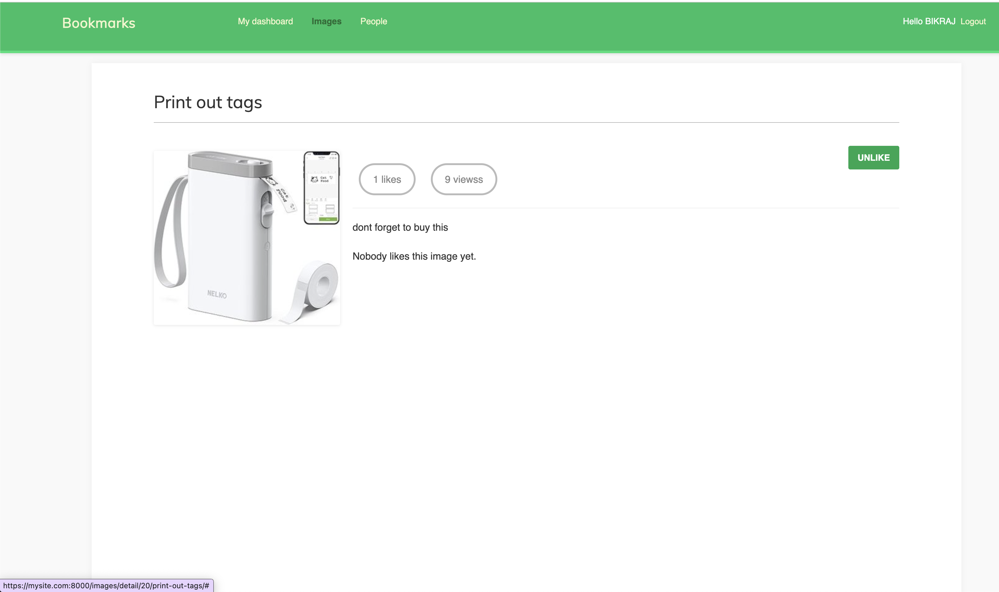

# Django Image Bookmarking App

## Overview
This is a **Django-based Image Bookmarking Application** that allows users to **bookmark images from any website, like images, view image rankings (using Redis), follow users, and enjoy infinite scrolling**. The project includes **authentication (Django & Social Auth)** and is powered by **SQLite** as the database.



## Features
- **User Authentication** (Django & Social Auth for Google Login)
- **Bookmark Images** 
- **Like & View Images**
- **Ranking System** (Using Redis to track image popularity)
- **Follow Other Users**
- **Infinite Scrolling**

## Tech Stack
- **Backend:** Django
- **Database:** SQLite
- **Authentication:** Django Auth & Social Auth
- **Caching & Ranking:** Redis
- **Frontend:** Django Templates, JavaScript (for infinite scrolling)

## Installation & Setup

1. **Clone the Repository:**
   ```sh
   git clone https://github.com/bikraj2/bookmark
   cd bookmark
   ```

2. **Create & Activate a Virtual Environment:**
   ```sh
   python -m venv env
   source env/bin/activate  # On Windows use `env\Scripts\activate`
   ```

3. **Install Dependencies:**
   ```sh
   pip install -r requirements.txt
   ```

4. **Apply Migrations:**
   ```sh
   python manage.py migrate
   ```

5. **Run the Development Server:**
   ```sh
   python manage.py runserver
   ```
   Server over https using
   ```sh
      python3 manage.py runserver_plus --cert-file cert.cert     
   ```

## Authentication
- Users can **sign up/log in using Django authentication**.
- **Google Login** is enabled using `social-auth-app-django`.
- Users must be logged in to bookmark images.

## Bookmarking Images
- Users can **bookmark images from external websites**.
- Images are stored in the **database** and associated with the user.
- **Liked images** are saved and ranked using **Redis**.

## Image Ranking (Redis)
- **Tracks image views & likes**.
- **Popular images appear first** based on interactions.
- Uses Redis **sorted sets** for ranking.

## Infinite Scrolling
- JavaScript **detects scrolling** and dynamically loads more images.
- Improves performance by **loading images on demand**.

## Following Users
- Users can **follow & unfollow others**.
- **See images from followed users** in the feed.

